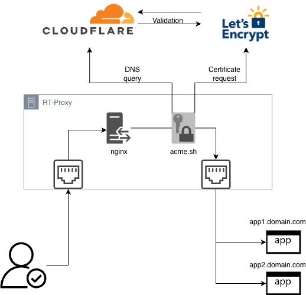

# RTProxy

Self-contained installer for a lightweight Nginx reverse proxy with
automatic TLS management using acme.sh

------------------------------------------------------------------------

# RTProxy -- Lightweight Automated Reverse Proxy with TLS

RTProxy is a **lightweight reverse proxy automation framework** designed
to quickly publish internal services over HTTPS with minimal operational
effort.

It combines:

-   **Nginx** (reverse proxy engine)
-   **acme.sh** (ACME client for TLS certificates)
-   **Let's Encrypt** (certificate authority)
-   Optional **Cloudflare DNS‑01 validation**
-   A simple **CLI management tool (`rtproxy`)**

RTProxy is intended for environments where you want **secure HTTPS
publishing without the complexity of full ingress controllers such as
Traefik or Kubernetes ingress**.

------------------------------------------------------------------------

# Key Design Goals

RTProxy was designed with the following priorities:

• Minimal operational complexity\
• Fully automated certificate lifecycle\
• CLI-based management (no manual nginx editing)\
• Works for **internal and external services**\
• Easy deployment on **clean Linux servers**\
• Minimal dependencies\
• Secure by default

------------------------------------------------------------------------

# High-Level Architecture

  

RTProxy performs:

• TLS certificate issuance\
• Nginx configuration generation\
• HTTPS redirect configuration\
• automatic certificate renewal

------------------------------------------------------------------------

# Performance Architecture

For **maximum performance and network isolation**, RTProxy requires
**two Ethernet interfaces**.

This design separates **north‑south traffic** (client access) from
**east‑west traffic** (backend services).

Benefits:

• improved packet processing efficiency\
• separation of security zones\
• easier firewall policy control\
• reduced contention between ingress and backend traffic\
• higher performance under load

------------------------------------------------------------------------

# Requirements

## Supported OS

-   Debian 12+
-   Ubuntu 22.04+
-   Minimal Linux server installation

## Hardware Requirements

Minimum:

-   2 CPU cores
-   2 GB RAM
-   10 GB disk

Recommended:

-   4 CPU cores
-   4 GB RAM

## Network Requirements

RTProxy **requires two Ethernet interfaces**:

  Interface   Purpose
  ----------- ----------------------------
  eth0        Public / ingress interface
  eth1        Internal service network

This separation provides **maximum performance and cleaner
architecture**.

## Other Requirements

-   root access
-   outbound internet connectivity
-   DNS control for the domains used
-   optional: Cloudflare account for DNS validation

------------------------------------------------------------------------

# Components Installed

The installer automatically installs and configures the following
components.

  Component             Description
  --------------------- -------------------------------------
  Nginx                 Reverse proxy engine
  acme.sh               ACME certificate management
  rtproxy CLI           Management tool
  Nginx configuration   Automatic reverse proxy definitions
  Certificate storage   TLS certificate management

------------------------------------------------------------------------

# Installation

Run the installer:

``` bash
sudo bash install-rtproxy.sh
```

The installer performs:

1.  Dependency installation\
2.  Nginx installation and configuration\
3.  acme.sh installation\
4.  CLI tool installation\
5.  Directory structure creation\
6.  Logging configuration\
7.  TLS configuration

------------------------------------------------------------------------

# Directory Layout

    /etc/rtproxy/
        config.env

    /etc/nginx/rtproxy/
        sites/

    /etc/nginx/ssl/
        certificates

    /var/www/rtproxy/
        ACME challenges

    /opt/acme.sh/
        ACME client

    /usr/local/bin/rtproxy
    /usr/local/sbin/rtproxy

------------------------------------------------------------------------

# CLI Usage

Main command:

``` bash
rtproxy
```

------------------------------------------------------------------------

# Add a Service

    rtproxy add <fqdn> <backend>

Example:

    rtproxy add grafana.example.com http://10.10.0.5:3000

RTProxy automatically:

1.  requests a TLS certificate\
2.  installs the certificate\
3.  generates nginx configuration\
4.  reloads nginx

Result:

    https://grafana.example.com

------------------------------------------------------------------------

# Add HTTPS Backend

    rtproxy add proxmox.example.com https://10.10.0.10:8006

RTProxy automatically disables backend certificate validation for
internal services.

------------------------------------------------------------------------

# Remove Service

    rtproxy remove <fqdn>

Example:

    rtproxy remove grafana.example.com

Removes:

-   nginx configuration
-   certificate files
-   ACME entries

------------------------------------------------------------------------

# List Services

    rtproxy list

Example output:

    grafana.example.com
    proxmox.example.com
    netbox.example.com

------------------------------------------------------------------------

# Certificate Renewal

Certificates are renewed using:

    rtproxy renew-all

Internally executes:

    acme.sh --cron

Recommended cron:

    0 2 * * * root rtproxy renew-all

------------------------------------------------------------------------

# Configuration

Main configuration file:

    /etc/rtproxy/config.env

Example:

    MODE="internal"
    INGRESS_IF="eth0"
    BACKEND_IF="eth1"
    LE_EMAIL="admin@example.com"
    WEBROOT="/var/www/rtproxy"
    ACME_HOME="/opt/acme.sh"
    ACME_SERVER="letsencrypt"
    WARN_DAYS="14"
    CRIT_DAYS="7"

------------------------------------------------------------------------

# Cloudflare DNS-01 Validation Setup

RTProxy supports issuing TLS certificates using **DNS-01 validation
through Cloudflare**.

This mode is recommended when:

-   services are **internal only**
-   port **80 cannot be opened**
-   infrastructure must remain **private**
-   certificates are required for **management platforms**

Examples:

    grafana.internal.example.com
    proxmox.lab.example.com
    netbox.mgmt.example.com

DNS-01 validation allows Let's Encrypt to verify domain ownership by
checking a temporary **TXT record in DNS**.

------------------------------------------------------------------------

## Creating a Cloudflare API Token

Open the Cloudflare dashboard:

    https://dash.cloudflare.com/profile/api-tokens

Select:

    Create Token

Choose:

    Custom Token

------------------------------------------------------------------------

## Required Token Permissions

Configure the token with the following permissions.

  Permission           Purpose
  -------------------- ------------------------------------
  Zone → DNS → Edit    Create and remove ACME TXT records
  Zone → Zone → Read   Discover zone configuration

Example permission set:

    Zone.DNS:Edit
    Zone.Zone:Read

------------------------------------------------------------------------

## Restrict Token Scope

For security reasons the token should be limited to the specific DNS
zone used by RTProxy.

Example:

    example.com

Avoid granting access to **All Zones** unless absolutely necessary.

------------------------------------------------------------------------

## Configure RTProxy

Edit the configuration file:

    /etc/rtproxy/config.env

Add:

    DNS_PROVIDER="dns_cf"
    CF_Token=YOUR_CLOUDFLARE_API_TOKEN

Example:

    DNS_PROVIDER="dns_cf"
    CF_Token=xxxxxxxxxxxxxxxxxxxxxxxxxxxx

------------------------------------------------------------------------

## DNS Validation Workflow

During certificate issuance the following process occurs:

1.  RTProxy requests a certificate via **acme.sh**\
2.  acme.sh creates a TXT record in Cloudflare

Example:

    _acme-challenge.example.com

3.  Cloudflare publishes the TXT record\
4.  Let's Encrypt queries the DNS record\
5.  Domain ownership is validated\
6.  Certificate is issued\
7.  acme.sh removes the TXT record automatically

This process normally completes within **10-30 seconds** depending on
DNS propagation.

------------------------------------------------------------------------

## Manual DNS Challenge Test

You can verify Cloudflare integration using:

    acme.sh --issue \
      --dns dns_cf \
      -d test.example.com

During validation a TXT record will appear:

    _acme-challenge.test.example.com

Check propagation with:

    dig TXT _acme-challenge.test.example.com

------------------------------------------------------------------------

# Security Model

RTProxy follows several security best practices:

• HTTPS enforced automatically\
• TLS private keys stored with restricted permissions\
• backend networks isolated from public ingress\
• minimal software footprint\
• no web UI attack surface

Key permissions:

    chmod 600 private keys
    chmod 644 certificates
    chmod 600 config.env

------------------------------------------------------------------------

# Example Use Cases

RTProxy is ideal for publishing internal services such as:

-   Grafana
-   NetBox
-   AWX
-   Rundeck
-   Proxmox
-   NAS interfaces
-   monitoring dashboards

It works especially well for:

• homelabs\
• infrastructure management portals\
• DevOps environments\
• internal tooling

------------------------------------------------------------------------

# Comparison

  Feature                  RTProxy      Traefik   Caddy
  ------------------------ ------------ --------- --------
  Complexity               Low          Medium    Low
  Automation               Yes          Yes       Yes
  Operational footprint    Very small   Medium    Medium
  Kubernetes integration   No           Yes       No
  CLI management           Yes          Limited   No

RTProxy is intended for **simple infrastructure publishing scenarios**
rather than large orchestrated environments.

------------------------------------------------------------------------

# Logging

Logs are stored in:

    /var/log/rtproxy.log
    /var/log/rtproxy-check.log
    /var/log/rtproxy-install.log

Example:

    tail -f /var/log/rtproxy.log

------------------------------------------------------------------------

# Troubleshooting

Check nginx configuration:

    nginx -t

Check nginx status:

    systemctl status nginx

Check ACME configuration:

    /opt/acme.sh/

------------------------------------------------------------------------

# Roadmap

Future improvements may include:

• multi-node cluster support\
• additional DNS providers\
• wildcard certificate support\
• backend health checks\
• Prometheus metrics\
• rate limiting\
• authentication layer\
• high availability mode

------------------------------------------------------------------------

# License

MIT License

------------------------------------------------------------------------

# Author

Luca Biancorosso
